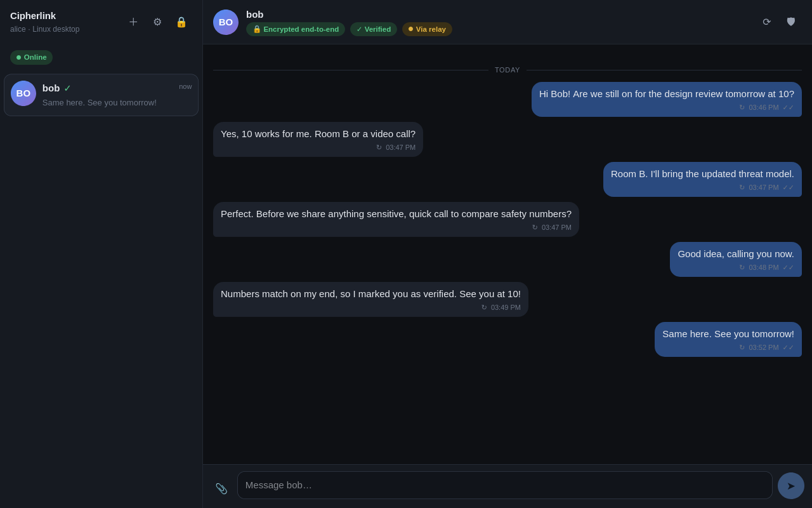
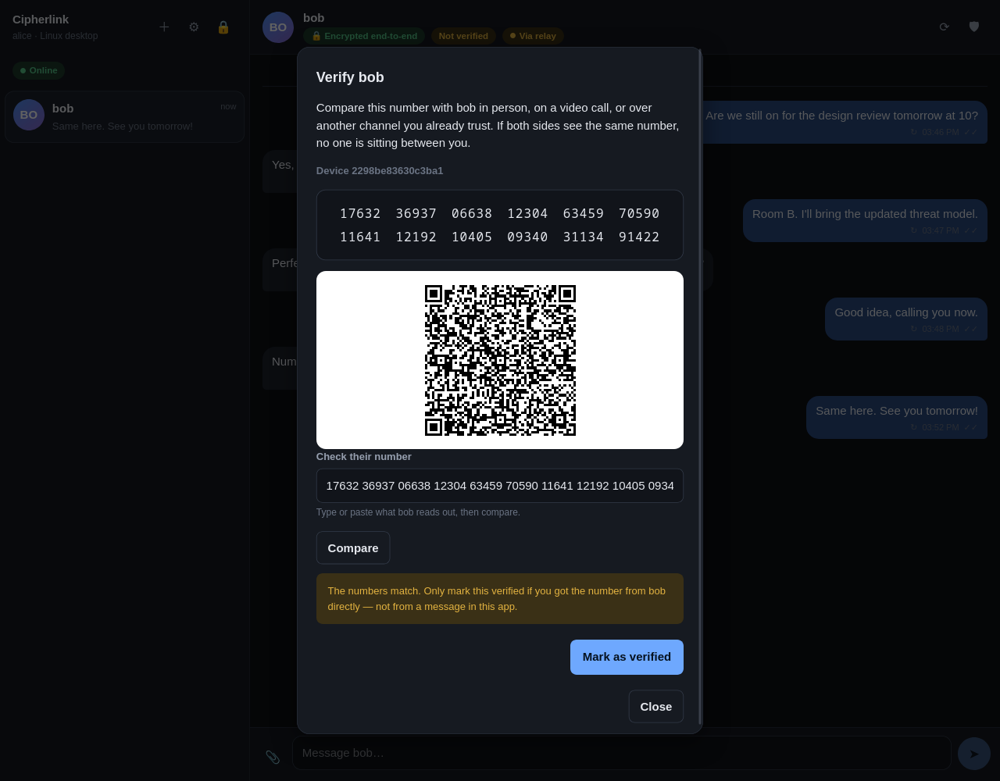

# Cipherlink

A privacy-first, peer-to-peer chat application where message content is
end-to-end encrypted with **MLS (RFC 9420)**. Messages travel directly between
devices over WebRTC DataChannels when that is possible, and through a relay
that carries ciphertext it cannot read when it is not.

> **What this is and is not.** This is a working reference implementation with
> a documented threat model and a test suite that demonstrates its central
> claims. It has not been audited, has not been deployed, and has not been
> attacked by anyone but itself. It is not anonymity software. Read
> [SECURITY.md](SECURITY.md) and [THREAT_MODEL.md](THREAT_MODEL.md) before
> trusting it with anything that matters.


<table>
  <tr>
    <td width="50%"></td>
    <td width="50%"></td>
  </tr>
  <tr>
    <td align="center"><sub>A verified conversation; the relay only ever carries ciphertext</sub></td>
    <td align="center"><sub>Safety-number verification, compared over a channel you trust</sub></td>
  </tr>
</table>

---

## What it actually protects

| Property | Status | Where it comes from |
| --- | --- | --- |
| Message content is unreadable by the server | Yes | MLS; the server holds no group secret |
| Tampering with a message is detected | Yes | MLS signatures + AEAD |
| Replayed messages are rejected | Yes | MLS generation counters, plus app-level de-duplication |
| Forward secrecy | Yes | MLS key schedule; per-message keys are deleted after use |
| Post-compromise security | Yes | MLS commits rotate group keys and lock out a past compromise |
| You are talking to the right person | **Only after you verify** | Safety-number comparison; the directory is not trusted |
| Attachments are unreadable by the server | Yes | AES-256-GCM client-side, fresh key per file, key sent inside MLS |
| Local data is encrypted at rest | Yes | Argon2id-derived vault key; AES-256-GCM records |
| The server does not learn *who* talks to *whom* | **No** | See [THREAT_MODEL.md](THREAT_MODEL.md) |
| Your IP address is hidden | **No** | Visible to the server, and to your peer on a direct connection |
| Protection from malware on your device | **No** | Nothing an app can do about this |

## Cryptography

Nothing cryptographic is implemented in this repository. Every primitive comes
from an established implementation.

| Purpose | Algorithm | Provided by |
| --- | --- | --- |
| Secure messaging protocol | MLS, RFC 9420 | [`@wireapp/core-crypto`](https://github.com/wireapp/core-crypto) (Rust, WASM + Node builds) |
| Key agreement | X25519 (HPKE DHKEM) | core-crypto |
| Signatures / device identity | Ed25519 | core-crypto (messaging), [`@noble/curves`](https://github.com/paulmillr/noble-curves) (server auth) |
| Message AEAD | ChaCha20-Poly1305, 256-bit key | core-crypto |
| Key derivation (protocol) | HKDF-SHA-256 | core-crypto |
| Attachment & local-storage AEAD | AES-256-GCM | WebCrypto (platform) |
| Passphrase stretching | Argon2id | [`@noble/hashes`](https://github.com/paulmillr/noble-hashes) |
| Fingerprint derivation | PBKDF2-HMAC-SHA-512 | WebCrypto (platform) |
| Randomness | Platform CSPRNG | `crypto.getRandomValues` |

The MLS ciphersuite is
`MLS_128_DHKEMX25519_CHACHA20POLY1305_SHA256_Ed25519` (ciphersuite 3).

**On key sizes.** The "128" in that name is the ciphersuite's *security level*,
not a key length: X25519 provides roughly 128-bit classical security. The AEAD
key is 256 bits. Describing this application as "256-bit encrypted" would be
misleading, so we do not. [SECURITY.md](SECURITY.md#algorithms-and-key-sizes)
breaks down every parameter.

Why MLS rather than the Signal protocol: see
[SECURITY.md](SECURITY.md#why-mls).

## Architecture

```
                    ┌──────────────────────────┐
                    │    Signaling server      │
                    │                          │
                    │  accounts, device keys,  │
                    │  key packages, SDP/ICE,  │
                    │  ciphertext relay        │
                    │                          │
                    │  never sees: plaintext,  │
                    │  private keys, session   │
                    │  keys, file contents     │
                    └────────────┬─────────────┘
                                 │
                          signaling only
                                 │
                 ┌───────────────┴───────────────┐
                 │                               │
          ┌──────▼───────┐               ┌───────▼──────┐
          │   Client A   │◄─────────────►│   Client B   │
          │              │    WebRTC     │              │
          │ encrypt      │  DataChannel  │      decrypt │
          │ locally      │               │      locally │
          └──────────────┘               └──────────────┘

  When no direct path exists:

     Client A ──ciphertext──► Relay ──ciphertext──► Client B
```

See [ARCHITECTURE.md](ARCHITECTURE.md) for the full message lifecycle, module
layout and relay-fallback behaviour.

## Quick start

Requires Node 22 or newer.

```bash
npm install
npm run dev          # signaling server on :8787, client on :5173
```

Open <http://localhost:5173> in two different browser profiles (or one normal
and one private window — they need separate storage), register two accounts,
and start a conversation by username.

Run the tests:

```bash
npm test             # 127 tests, including the adversarial server suite
npm run typecheck
```

[DEVELOPMENT.md](DEVELOPMENT.md) covers project layout, configuration,
deployment notes and how to work on the code.

## Repository layout

```
shared/     wire protocol schemas, byte helpers, redacting logger
client/
  src/crypto/      MLS engine, attachment encryption, AEAD, randomness
  src/identity/    device auth key, safety numbers, trust store
  src/messaging/   message lifecycle, receipts, key-rotation policy
  src/p2p/         WebRTC transport, relay fallback, signaling, REST client
  src/storage/     vault, encrypted record store, repositories
  src/ui/          React interface
  src/app/         session assembly
server/
  src/identity/    accounts, devices, authentication, key package directory
  src/signaling/   WebSocket hub
  src/relay/       ciphertext queue, encrypted blob store
tests/      crypto, networking, server, security and end-to-end suites
```

## Verifying a contact

Encryption tells you the message was not readable in transit. It does not tell
you *who* holds the other end. The key-package directory is run by the server,
and a hostile server could hand out its own key package instead of your
contact's.

Comparing safety numbers is what closes that gap. Open a conversation, tap the
shield, and compare the 60-digit number (or scan the QR code) with your contact
over a channel you already trust. Until you do, the app shows the conversation
as **Not verified** — and it says so plainly rather than showing a padlock and
leaving you to assume.

If a contact's number ever changes, the app marks it **Security code changed**,
holds outgoing messages, and asks you to check. It never silently accepts the
new key.

## Documentation

- [ARCHITECTURE.md](ARCHITECTURE.md) — components, message lifecycle, data flows
- [SECURITY.md](SECURITY.md) — algorithms, protocol properties, server trust
- [THREAT_MODEL.md](THREAT_MODEL.md) — adversaries, what is and is not defended
- [DEVELOPMENT.md](DEVELOPMENT.md) — setup, configuration, testing, deployment
- [SECURITY_REVIEW.md](SECURITY_REVIEW.md) — findings from the review of this codebase

## Licence

MIT.
